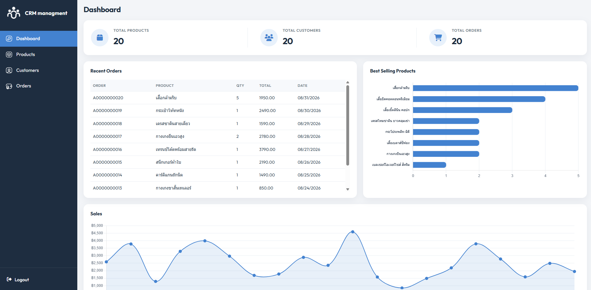
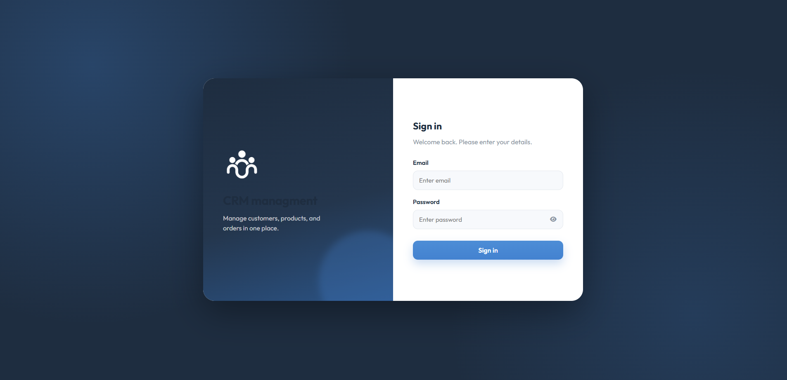
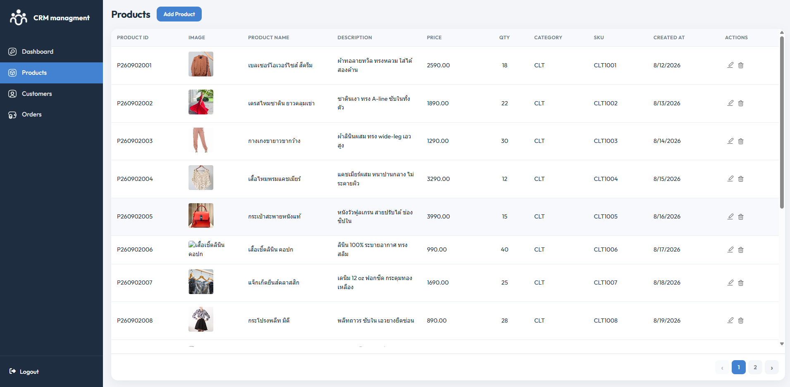
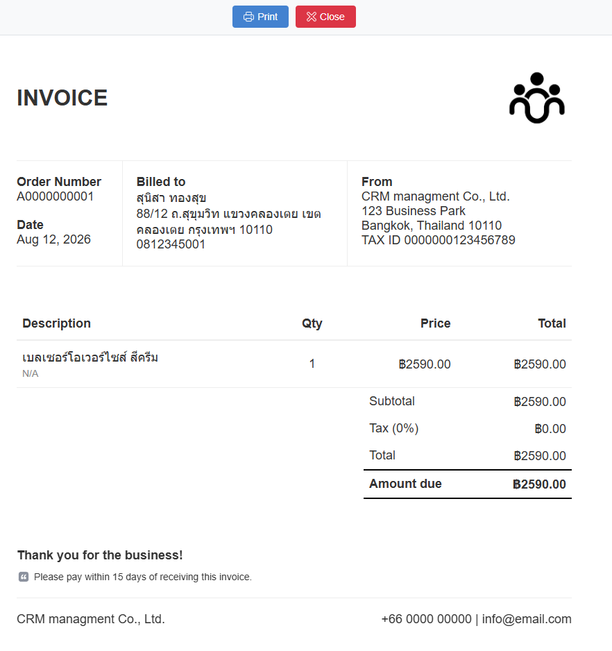

# CRM managment

A CRM for **products, customers, and orders**.  
Vue 3 frontend on Vercel. API on AWS Lambda + MongoDB Atlas.

**Live demo:** _paste URL here_  
**Login:** `admin@mail.com` / `1234`

## Preview









---

## Features

- Demo login (`admin@mail.com` / `1234`)
- Dashboard
  - Product / customer / order counts
  - Latest 10 orders
  - Best-seller bar chart (sum of order amounts)
  - Daily sales line chart
- Products: create, edit, delete, image upload, categories (clothing, electronics, etc.)
- Customers: create, edit, delete (Save stays disabled until the form is valid)
- Orders: create, edit, delete, print invoice
- Inner-scrolling tables, 15 rows per page

---

## Stack

| Layer | Tech |
| --- | --- |
| Frontend | Vue 3, TypeScript, Vue Router, Vite |
| UI | Project CSS, Font Awesome, SweetAlert2, Chart.js |
| Hosting (SPA) | Vercel (`vercel.json` rewrites to `index.html`) |
| API | Node.js 18+, AWS Lambda, API Gateway HTTP API |
| Database | MongoDB Atlas + Mongoose |

---

## Architecture

```text
Browser (Vue SPA)
    |  VITE_API_URL
    v
API Gateway  →  Lambda (api/index.js)
                    |
                    v
              MongoDB Atlas
              collections: products, customers, orders, ratelimits
```

- SPA calls the API through `src/api.ts` (`apiFetch`)
- Lambda routes `/api/{resource}` and runs CRUD
- CORS from `SPA_ORIGIN`; rate limits stored in `ratelimits`

---

## Project structure

```text
serverless-crm/
├── src/
│   ├── views/                 # screens (Login, Dashboard, lists, edit)
│   ├── components/            # layout, forms, buttons, invoice HTML
│   ├── router/index.ts        # routes + auth guard
│   ├── auth.ts                # demo login (localStorage)
│   ├── api.ts                 # API fetch wrapper
│   └── config.ts              # VITE_API_URL
├── api/
│   └── index.js               # Lambda handler
├── seeds/                     # fashion sample data
├── docs/                      # README screenshots
├── public/favicon.png
├── vercel.json
└── package.json
```

---

## Frontend setup

Requires Node.js 18+ and a deployed API URL.

1. Install packages

```bash
npm install
```

2. Create `.env` at the repo root

```env
VITE_API_URL=https://<api-id>.execute-api.<region>.amazonaws.com/api
```

Do not add a trailing slash.

3. Dev server

```bash
npm run dev
```

Open `http://localhost:5173`

4. Production build

```bash
npm run build
npm run preview
```

---

## Demo login

| Email | Password |
| --- | --- |
| `admin@mail.com` | `1234` |

Client-side only.

- Successful login stores `crm_auth=1` in `localStorage`
- Any route except `/login` requires that flag; otherwise redirect to login
- Logout clears the flag and returns to `/login`

Credentials live in the frontend. This is not real auth — it is for the portfolio flow.

---

## Routes

| Path | Screen |
| --- | --- |
| `/login` | Sign in |
| `/` | Dashboard |
| `/products` `/products/add` `/products/edit/:id` | Products |
| `/customers` `/customers/add` `/customers/edit/:id` | Customers |
| `/orders` `/orders/add` `/orders/edit/:id` | Orders + print invoice |

---

## Data models (MongoDB)

Dashboard charts do not need extra collections; they are computed from `orders`.

### products

| Field | Meaning |
| --- | --- |
| `product_id` | Product id (e.g. `P260902001`) |
| `imge_url` | Image URL or base64 (spelling matches the original schema) |
| `product_name` | Name |
| `description` | Description |
| `price` | Price |
| `quantity` | Stock |
| `category` | Category code, e.g. `CLT` clothing |
| `sku` | SKU |
| `createdAt` | Created at |

Form categories: `ELC` electronics, `CLT` clothing, `FOD` food, `BOK` books, `TOY` toys

### customers

| Field | Meaning |
| --- | --- |
| `customer_id` | Customer id |
| `full_name` | Name |
| `address` | Address |
| `telephone` | Phone |
| `order_number` | Linked order number |
| `date` | Date |

### orders

| Field | Meaning |
| --- | --- |
| `order_id` | Order id |
| `order_number` | Order number (matched to the customer when printing an invoice) |
| `product_name` | Product name |
| `price` | Unit price |
| `amount` | Quantity |
| `total` | Line total |
| `order_date` | Order date |

---

## API (Lambda)

Handler file: `api/index.js`  
Base path: `/api`

### Environment (Lambda)

| Variable | Required | Meaning |
| --- | --- | --- |
| `MONGODB_URI` | Yes | Connection string including the DB name, e.g. `...mongodb.net/myCRMs` |
| `SPA_ORIGIN` | Recommended | Frontend origin, e.g. `https://your-app.vercel.app`, or `*` while testing |
| `RATE_PER_MINUTE` | No | Default `30` |
| `MONTHLY_LIMIT` | No | Default `100000` |

### API Gateway routes (HTTP API)

- `ANY /api`
- `ANY /api/{proxy+}`

Enable CORS to match the frontend origin.

### Endpoint examples

Assume base = `https://xxxx.execute-api.us-east-1.amazonaws.com/api`

| Method | Path | Action |
| --- | --- | --- |
| GET | `/` or `/health` | Health |
| GET | `/customers` `/orders` `/products` | List all |
| GET | `/customers/{id}` | Get one |
| POST | `/customers` | Create (requires `customer_id`, `full_name`) |
| PUT / PATCH | `/customers` | Update; send `customer_id` in the body or path |
| DELETE | `/customers` | Delete; send `customer_id` |

Orders and products use the same pattern.  
Create order requires `order_id`, `order_number`.  
Create product requires `product_id`, `product_name`.

Notable responses

- Create / update / delete success: `{ "status": "success", ... }`
- Duplicate id: `409 duplicate id`
- Rate limited: `429`

Pack the Lambda

```bash
cd api
npm install
npm run build
```

Upload the zip from the `bestzip` script to Lambda.

More detail: `api/lambda-v2.md`, `api/aws-serverless-apigateway-http.md`

---

## Deploy frontend (Vercel)

1. Connect the Git repo
2. Build command: `npm run build`
3. Output: `dist`
4. Environment: `VITE_API_URL` = the live API URL
5. `vercel.json` rewrites every path to `index.html` so Vue Router works on refresh

Rebuild after changing env vars; Vite inlines them at build time.

---

## npm scripts

Repo root

```bash
npm run dev
npm run build
npm run preview
```

`api/`

```bash
npm run build   # zip Lambda
npm run seed    # load sample data (needs MONGODB_URI)
```
